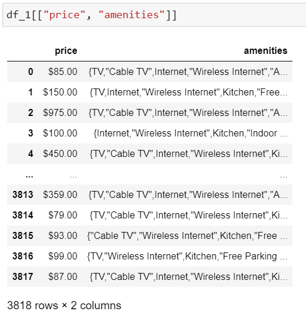
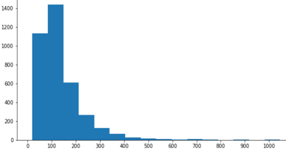
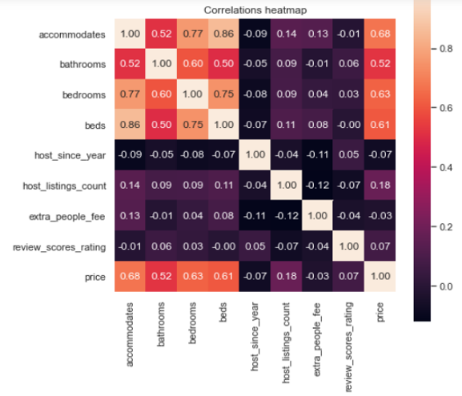
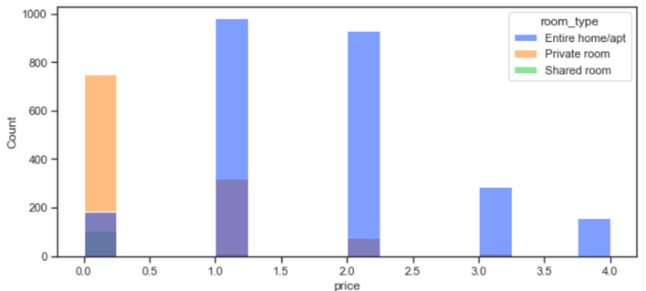
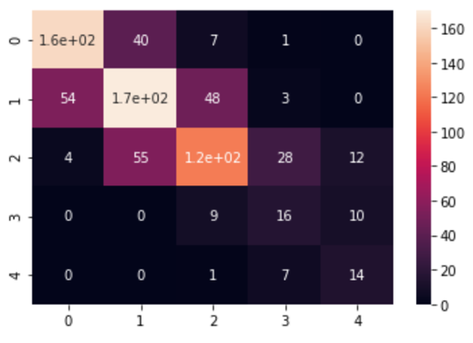
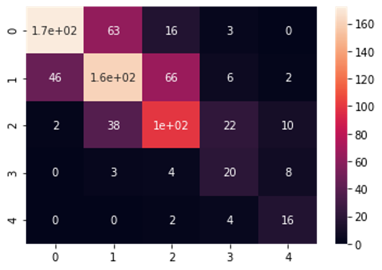
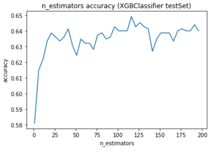
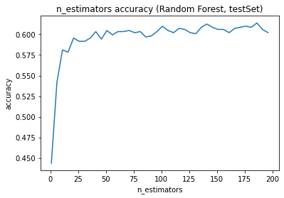

# Airbnb Machine Learning
## Introduction:
The goal of this project is to predict acceptable price range given particular properties of a house on Airbnb so that Airbnb can provide appropiate pricing for hosts. Therefore, hosts can optimize their incomes by setting the price into acceptable price range. Therefore, we are here to answer the question, *"How to price a new listing on Airbnb?* Some feature engineering, data cleaning and model selection techniques are employed in this project. This documentation will explain algorithms used for extracting information to improve accuracy and learning methods to get the best result.

The dataset is obtained from <a href="https://www.kaggle.com/airbnb/seattle">kaggle</a> which contains data in Seattle. There are many attributes (92) for houses including their own ids. 

## Data Prepocessing:
We use a number of features to do the prediction, the selected features are depicted in following coding:
```
cols = ['accommodates', 'bathrooms', 'bedrooms', 'beds', "price", "number_of_reviews", "room_type", "host_listings_count", 
        "review_scores_location", "review_scores_rating", "minimum_nights", "guests_included", "property_type", "amenities"]
```
This results came from *PCA*, which analyzed the importance index of features. We selected around 10-20 attributes so that the model will not overfit. First due to the format of attri "price" and "amenities", ```apply``` function was required to change their formats.

<p align="center"></p>

For "price", we used ```apply``` function to replace the *$*, "," signs and changed them to float instead of string:
```
df_1["price"] = df_1["price"].apply(lambda x : float(x.replace("$", "").replace(",", "")))
```
For better interpretation, we defined a specific function to make "price" becomes categorical.
```
def priceCat(x):
    if x>=0 and x<=75:
        return 0
    elif x>=76 and x<=120:
        return 1
    elif x>=121 and x<=200:
        return 2
    elif x >= 201 and x<= 300:
        return 3
    elif x>=301:
        return 4
    else:
        return np.nan
    
df_1["price"] = df_1["price"].apply(priceCat)
```
*note : More research is required to determine better price ranges for analysis/ business' usage.*

"amenities" attribute contains information in string format, due to the importances of "amenities", we split each item in "amenities" into columns to make sure they
can be encoded in later sections:
```
def get_val_from_list(row, column_name, value):
    ''' Fill in dummy column for values '''
    val = 0.0
    try:
        vals = row[column_name].replace('[', '').replace("'", '').replace("]", '').replace('"', '').replace('{', '').replace('}', '').split(',')
        if value in vals:
            val = 1.0
    except:
        val = 0.0
    return val


def split_list_into_columns(df, column_name, max_dummies_num = 10):
    ''' Split values in columns, which contain lists (for example, amenities) '''

    # get dictionary of unique values in lists across dataset rows
    values_dict = {}

    for unique_value in df[column_name].unique(): 
        for value in unique_value.replace('[', '').replace("'", '').replace("]", '').replace('"', '').replace('{', '').replace('}', '').split(','):
            if value in values_dict:
                values_dict[value] = values_dict[value] + 1
            else:
                values_dict[value] = 0

    values_sorted = sorted(values_dict.items(), key=lambda kv: kv[1], reverse = True)

    # split into columns
    for value in values_sorted[: max_dummies_num]:
        df[column_name + '_' + value[0]] = df.apply(lambda row: get_val_from_list(row, column_name, value[0]),axis=1)

    return

split_list_into_columns(df_1, "amenities")
```
## Exploratory Data Analysis:
### Price Distribution:
<p align="center"></p>
The distribution indicates that the prices centered at 0-200, while the mean is around 128. After reaching the mean, the number of houses keep decreasing.

### Correlation Matrix:
<p align="center"></p>
This is a correlation matrix with heatmap function, the attributes which are highly correlated with "price" are *"accommodates", "bathrooms", "bedrooms" and "beds"*, aligned with the assumption at the beginning.

### Room Type Distribution:
<p align="center"></p>
When price is over $75, no "Private room" exists anymore. When price is not over $75, there is a large proportion of "Private room" exists.

## Encoders and Pipeline:
We employed one hot encoding and "constant" strategy to encode categorical data while "median" strategy was employed to encode numerical data. Afterward, we put all stategies and encoders into a pipeline to automate the machine learning process.

```
numeric_transformer = Pipeline(steps=[
    ('imputer', SimpleImputer(strategy='median'))
    ])

categorical_transformer = Pipeline(steps=[
    ('imputer', SimpleImputer(strategy='constant', fill_value='missing')),
    ("onehot", OneHotEncoder(handle_unknown="ignore"))
])

preprocessor = ColumnTransformer(
transformers= [
    ("num", numeric_transformer, numericList),
    ("cat", categorical_transformer, categoricalList)
])
```
*note: numericList and categoricalList are lists that contain numerical data and categorical data respectively by function ```select_dtypes```.*

## Outcomes:
### Confusion Matrix:
<p align="center"></p>
The L.H.S is confusion matrix of predicted y value and true ytag by using XGBoostClassifier and the R.H.S is confusion matrix of predicted y value and true ytag by using RandomForestClassifier. In these diagrams, diagonal elements have the brightest color indicating a large proportion of classes are predicted correctly. 

### parameter turning and maximum accuracy:
<p align="center"></p>
The L.H.S is a plot for XGBoostClassifier and R.H.S is a plot for RandomForestClassifier when x-axis is the value of *n_estimators*. As result suggested, XGBoostClassifier performs better than RandomForestClassifier, achieves 65% accuracy at *n_estimators=116* while RandomForestClassifier achieves maximum 63% at *n_estimators=86*, slightly lower than that of XGBoostClassifier.

## Improvements:
1. Due to the limitation of data set, the training process may not be sufficient enough to predict testing set with high accuracy, we can find another dataset with larger size.
2. We can do more research on price ranges such that the ranges are more acceptable for Airbnb, different price ranges will result in different predicted value as well. 
3. According to the "calender" csv file, which takes seasonality into account, if we combine this attribute into consideration, this may lead to better results. 


